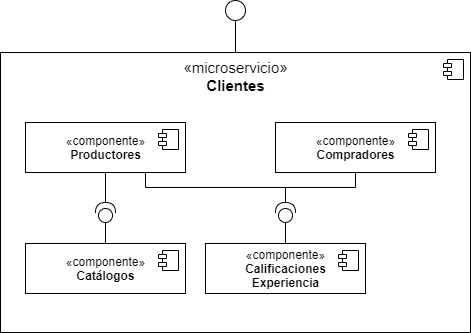

# Microservicio de Clientes

### 1. Resumen
Microservicio responsable de las operaciones relacionadas con los clientes Agroexportaciones Para Colombia, incluyendo los Productores, Compradores, Catálogos y Calificaciones de Experiencia.

### 2. Componentes a alto nivel

El siguiente diagrama ilustra los componentes a alto nivel.



### 3. Especificación de la API

A continuación se presenta la especificación de la API

#### 3.1 Obtener Productores

##### 3.1.1 Petición
|Parámetro|Valor|
|---|---|
|Método HTTP|GET|
|URI|/api/v1/productores|
|Encabezados de Petición|Content-Type=application/json|

##### 3.1.2  Respuesta

|Parámetro|Valor|
|---|---|
|Encabezados de Respuesta|Content-Type=application/json|

|Código HTTP|Cuerpo de Respuesta|
|---|---|
|200|```{"productores":[{"usuario":"julian_arango","identificacion":"123456789","tipoIdentificacion":"C","nombre":"Julián Arango","correo":"julian_arango@tucorreo.com"},{"usuario":"robinson_diaz","identificacion":"987654321","tipoIdentificacion":"C","nombre":"Robinson Díaz Uribe","correo":"robinson_diaz@tucorreo.com"}]}```|
|200|```{"productores":[]}```|
|500|```{"error":"Ocurrio un error","descripcionError":"Ocurrio un error de tipo ABC por la razon D"}```|

#### 3.2 Obtener Productor

##### 3.2.1 Petición
|Parámetro|Valor|
|---|---|
|Método HTTP|GET|
|URI|/api/v1/productores/{usuario}|
|Encabezados de Petición|Content-Type=application/json|

##### 3.2.2 Respuesta
|Parámetro|Valor|
|---|---|
|Encabezados de Respuesta|Content-Type=application/json|

|Código HTTP|Cuerpo de Respuesta|
|---|---|
|200|```{"usuario":"julian_arango","identificacion":"123456789","tipoIdentificacion":"C","nombre":"Julián Arango","correo":"julian_arango@tucorreo.com"}```|
|404|```{"error":"El productor no existe","descripcionError":"El Productor con usuario [julian] no existe."}```|
|500|```{"error":"Ocurrio un error","descripcionError":"Ocurrio un error de tipo ABC por la razon D"}```|

#### 3.3 Registrar Productor

##### 3.3.1 Petición
|Parámetro|Valor|
|---|---|
|Método HTTP|PUT|
|URI|/api/v1/productores/{usuario}|
|Encabezados de Petición|Content-Type=application/json|
|Cuerpo de Petición|```{"identificacion":"111111111","tipoIdentificacion":"C","primerNombre":"Fabiola","segundoNombre":"","primerApellido":"Posada","segundoApellido":"Pinedo","correo":"fabiola_posada@tucorreo.com", "clave":"L4sUp3rCl4v3"}```|

##### 3.3.2 Respuesta
|Parámetro|Valor|
|---|---|
|Encabezados de Respuesta|Content-Type=application/json </br> Location=/api/v1/productores/fabiola_posada|

|Código HTTP|Cuerpo de Respuesta|
|---|---|
|201|```{"usuario":"fabiola_posada","identificacion":"111111111","tipoIdentificacion":"C","primerNombre":"Fabiola","segundoNombre":"","primerApellido":"Posada","segundoApellido":"Pinedo","correo":"fabiola_posada@tucorreo.com"}```|
|200|```{"usuario":"fabiola_posada","identificacion":"111111111","tipoIdentificacion":"C","primerNombre":"Fabiola","segundoNombre":"Emilia","primerApellido":"Posada","segundoApellido":"Pinedo","correo":"fabiola_posada@tucorreo.com"}```|
|500|```{"error":"Ocurrio un error","descripcionError":"Ocurrio un error de tipo ABC por la razon D"}```|
